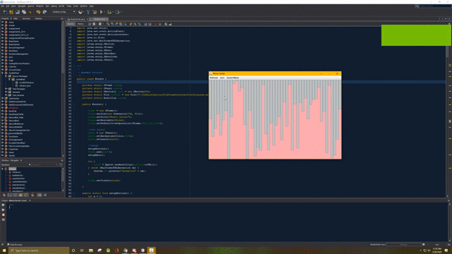

# Music Sorting Algorithm Visual
A GUI that shows an animation for a few sorting algorithms. 

# How it works
1. Select the algorithm you want to see. It will then start sorting
2. Hit the refresh button to unsort the tabs. Repeat.

# How to Run the Application
1. Download java runtime environment (jre) version 8 <a href="https://www.oracle.com/technetwork/java/javase/downloads/jre8-downloads-2133155.html">here</a> if you don't have it already.
2. Download and double-click on the executable InteractivePathFinding.jar file.

# Author
<a href="https://github.com/btror">Brandon</a>
